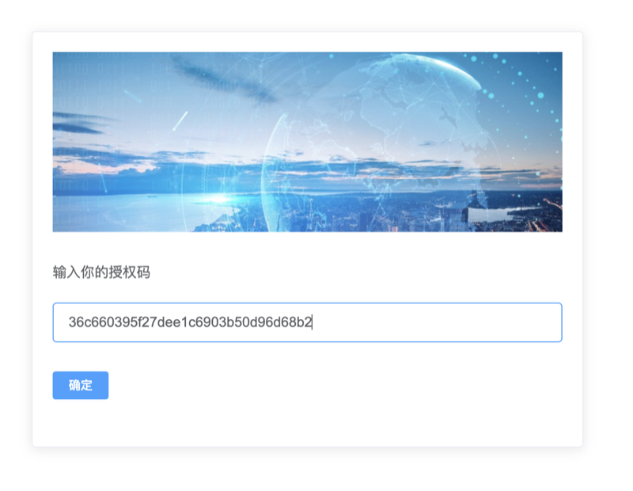
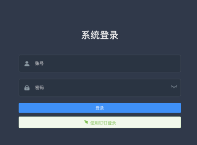

## 预先安装好docker环境
1. linux安装方法
2. window安装方法
   
不会的请先百度,Bing,Google

已经安装的请跳过

## 申请永久key

  


申请通过后，会收到key和token

比如

Key=1e72b8b81adfc14f0d09b5900e20c3f8
token=36c660395f27dee1c6903b50d96d68b2

## 一键运行安装脚本
linux方法

```
替换FKEY成你自己的
如果部分服务要关闭的话，注释即可

networkname="ziqi"
docker network create ${networkname}
basepath=/opt/ziqi_docker
FKey="1e72b8b81adfc14f0d09b5900e20c3f8"
suffixName=""
#建议输入平台类型好区分
hub="ziqiflow"


docker run --name ziqiflow${suffixName}   -t -i -d \
-p 18080:80 \
-p 28011:29011  \
-v ${basepath}/docker_v/work/:/docker_v/work/   \
-v ${basepath}/docker_v/flow/app/:/docker_v/app/   \
-v ${basepath}/docker_v/flow/cache/:/docker_v/cache/   \
-v ${basepath}/docker_v/flow/sessions/:/docker_v/sessions/   \
-v ${basepath}/docker_v/log/flow/:/var/log/flow/   \
-v ${basepath}/docker_v/log/ziqiruner/:/var/log/ziqi/   \
-e FKey=${FKey} \
--network ${networkname}  --network-alias ziqiflow \
-d --restart=always ${hub}/ziqiflow:1.0.8  /bin/bash -c "/auto.sh;/bin/bash"


# mysql：
docker run -p 3308:3306 --name ziqimysql${suffixName}  --restart=always \
-v ${basepath}/docker_v/mysql/conf:/etc/mysql \
-v ${basepath}/docker_v/mysql/logs:/var/log/mysql \
-v ${basepath}/docker_v/mysql/data:/var/lib/mysql \
--network ${networkname}  --network-alias ziqimysql \
-d  ${hub}/ziqi_mysql:1.0.6

# mongodb:
docker run -v ${basepath}/docker_v/mongodb/db:/data/db \
-v ${basepath}/docker_v/mongodb/conf:/conf \
--restart always  --name ziqimongo${suffixName}  -p 27019:27017 \
--network ${networkname}  --network-alias ziqimongo \
-d ${hub}/ziqi_mongo:1.0.18

# backup:
docker run -v ${basepath}/docker_v/backup:/backup \
-t -i -d \
--restart always  --name ziqibackup${suffixName} \
--network ${networkname}  --network-alias ziqibackup \
-d ${hub}/ziqi_backup:1.0.0  /bin/bash -c "/crontab_sh/auto.sh;/bin/bash"

```

window方法

```
```
之后访问http://localhost:18080 或http://本机ip:18080/


  


输入Token后，完成认证；等待10分钟左右

刷新页面直到出现如下图，就说明部署成功了

  


输入admin账号；密码ziqiflow789（记得修改或禁用）即可进入
接下来就是配置应用对接

## 绑定域名

域名解析到你的ip上即可

## 配置文件

### 如果你要对接的是企业微信自建应用 >>
[点击这里](./企业微信自建配置.md)

### 如果你要对接的是钉钉自建应用 >>
[点击这里](./钉钉自建应用配置.md)


## 如有疑问可在线联系我们