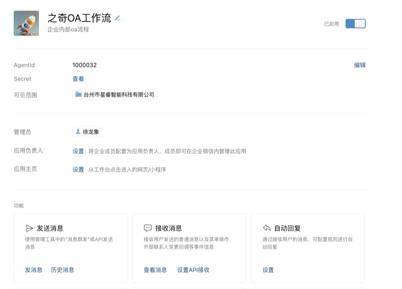
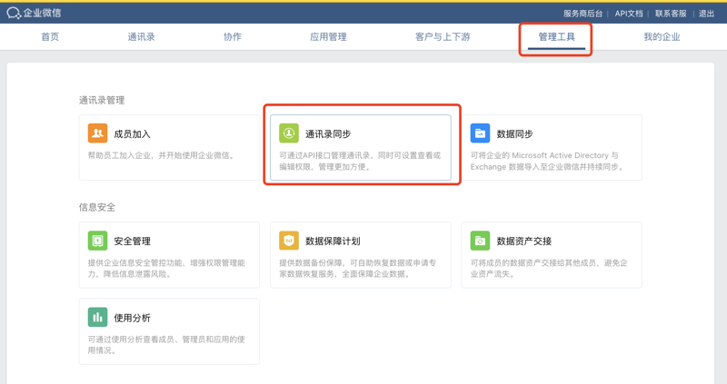

## 微信自建应用创建

### 第一步创建应用

进入企业微信后台：https://work.weixin.qq.com/wework_admin/frame#apps/createApiApp


进入应用管理->点击创建

  


填写应用信息

  

 
创建成功


### 第二步配置设置

进入应用页面
  


依次配置

#### (1) 应用主页
```{协议}://{域名}/ww/index.html```

  


#### (2) 设置可信域名

  


#### (3) 企业微信授权登录

  


#### (4)通讯录同步配置

管理工具 -> 通讯录同步

  

然后配置权限、企业可信IP（就是当前服务器的ip地址），查看secret 配置文件用会用到


设置接收事件服务器

**域名务必要和本企业关联的域名才行（企业微信的硬性要求）**

Token 和 EncodingAESKey 可以按随机生成，记录到配置文件中

  


点击保存会报错

原因是我们还没有在服务器上配置好对应的配置文件

```
配置文件
mkdir -p /opt/ziqiww_docker/docker_v/work/custom_soft/ziqi_prod/config/
vim /opt/ziqiww_docker/docker_v/work/custom_soft/ziqi_prod/config/wechat.php

<?php
return [
    /*
     * 默认配置，将会合并到各模块中
     */
    'defaults' => [
        /*
         * 指定 API 调用返回结果的类型：array(default)/collection/object/raw/自定义类名
         */
        'response_type' => 'array',

        /*
         * 使用 Laravel 的缓存系统
         */
        'use_laravel_cache' => true,

        /*
         * 日志配置
         *
         * level: 日志级别，可选为：
         *                 debug/info/notice/warning/error/critical/alert/emergency
         * file：日志文件位置(绝对路径!!!)，要求可写权限
         */
        'log' => [
            'level' => env('WECHAT_LOG_LEVEL', 'debug'),
            'file' => env('WECHAT_LOG_FILE', storage_path('logs/wechat.log')),
        ],
    ],

    /*
     * 企业微信
     */
    'work' => [

        'default' => [
            'corp_id' => 'wwbb2a1431420389ea',//https://work.weixin.qq.com/wework_admin/frame#/profile/enterprise 页面底部查看到
            'agent_id' => 1000032,//应用的AgentId
            'secret'   => 'oTv2SrLBH1M_LPoc0RQxXDBsS2lSkcLqTT2BKUYnsxU'//应用的Secret
        ],
        'concact' => [

            'corp_id' => 'wwbb2a1431420389ea',//https://work.weixin.qq.com/wework_admin/frame#/profile/enterprise 页面底部查看到
            'agent_id' => 1000032,//应用的AgentId
            'secret'   => 'oTv2SrLBH1M_LPoc0RQxXDBsS2lSkcLqTT2BKUYnsxU'//应用的Secret；注意此处也是和上面一样的。通讯录secret没啥用的。

            'token' => 'YPZnQPCZ5gkoGah6',
            'aes_key' => 'mKBozg96fsmy2i452JmCkhPRdT321mp3QG4J70xBzdM',
        ],

    ],
    //错误消息通知人
    'error_message_toer'=>'',
];


重启 docker 容器

docker restart ziqiflowww

```


然后手动触发同步通讯录(后期做成自动的)

curl http://127.0.0.1/autoexe/wechatwork/sync?type=dept

curl http://127.0.0.1/autoexe/wechatwork/sync?type=role

curl http://127.0.0.1/autoexe/wechatwork/sync?type=user

以上方式为全量方式，如果通讯录比较大会比较慢

输入域名：```{协议}://{域名}```即可跳转到登录页面

默认账号为admin 密码：ziqiflow789 **（务必记得要修改或删除此账号）**

在网页中也使用二维码扫码登录
  

  

