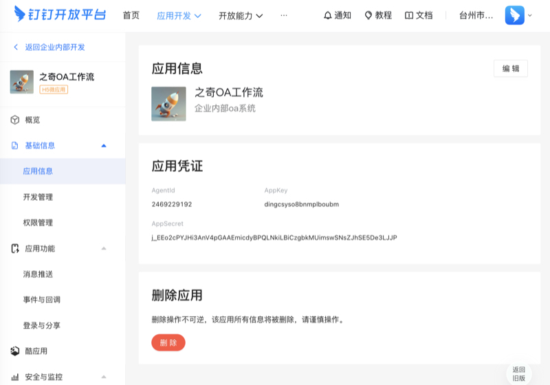
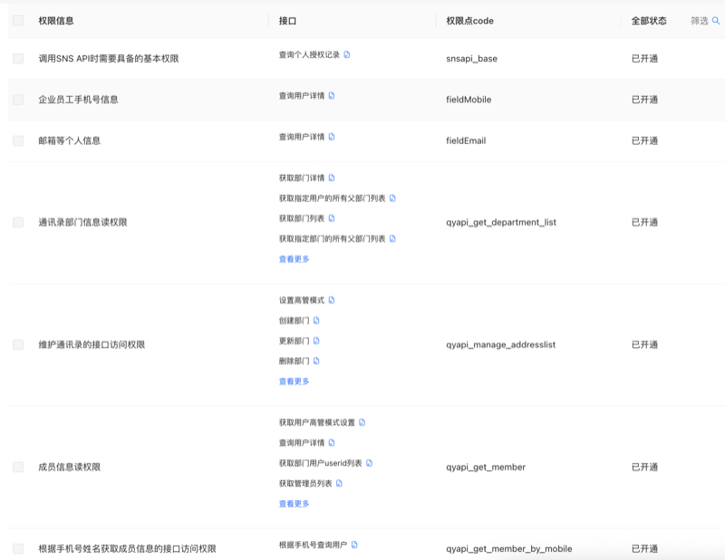
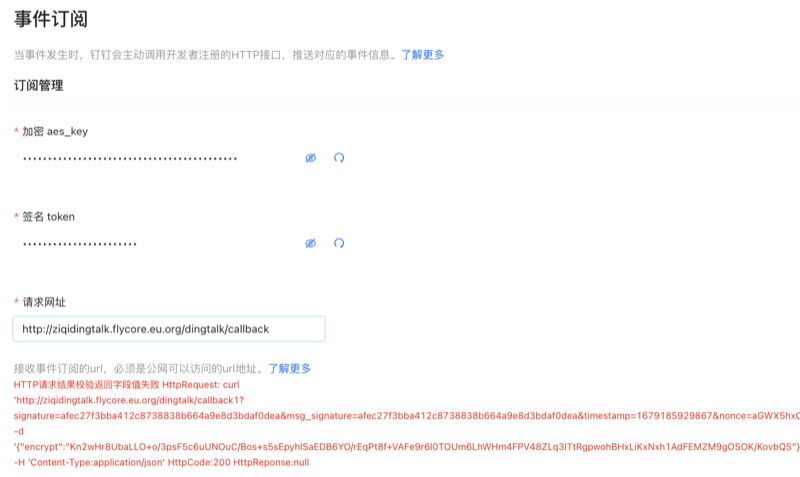
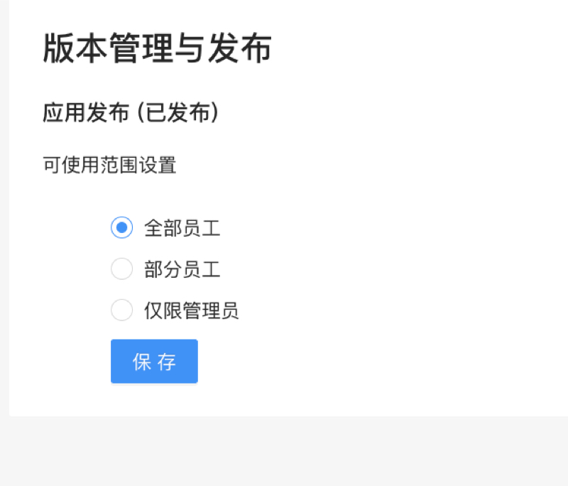

## 钉钉自建应用创建

### 第一步创建应用

进入钉钉应用后台：https://open-dev.dingtalk.com/fe/app#/corp/app


点击创建

  


填写应用信息

  


创建成功


### 第二步配置设置

进入应用页面

  


依次配置

#### 配置开发管理

  


```{协议}://{域名}/```

开发模式:```开发应用```

服务器出口IP:```175.24.178.177```

应用首页地址:```{协议}://{域名}/dingtalk/index.html#/mobile/workbench```

PC端首页地址:```{协议}://{域名}/dingtalk/index.html```


管理后台地址:``` {协议}://{域名}/dingtalk/index.html ```

#### 配置权限管理


基本上是通讯录管理、身份验证、获取凭证（三大类）的全部权限

  
  

  

  

  


#### 事件与回调

请求网址:``` {协议}://{域名}/dingtalk/callback ```

点击保存的时候

  


报错了；原因是我们还没有在服务器上配置好对应的配置文件

```
配置文件
mkdir -p /opt/ziqi_docker/docker_v/work/custom_soft/ziqi_prod/config/
/opt/ziqi_docker/docker_v/work/custom_soft/ziqi_prod/config/dingtalk.php

<?php
return [
    'ziqi'=>[
        'AgentId'=>'2469229192',//应用凭证里面的AgentId
        'DingTalkOptions'=>[
            'appkey' => 'dingcsyso8bnmplboubm',//应用凭证里面的AppKey
            'appsecret' => 'j_EEo2cPYJHi3AnV4pGAAEmicdyBPQLNkiLBiCzgbkMUimswSNsZJhSE5De3LJJP',//应用凭证里面的AppSecret
        ],
        'corp_id'=>'ding1c52c8d0a88b374ea1320dcb25e91351',//在js登录的时候用到的；来自右上角头像处（企业的唯一id号码）
        //扫码登录的时候用的。
        'QrCodeOptions'=>[
            'appId'=>'dingcsyso8bnmplboubm',//应用凭证里面的AppKey
            'appSecret'=>'j_EEo2cPYJHi3AnV4pGAAEmicdyBPQLNkiLBiCzgbkMUimswSNsZJhSE5De3LJJP'//应用凭证里面的AppSecret
        ],
        //回调的配置
        'CallbackOptions'=>[
            "aes_key"=>"iOwikVBYm79cwjMv9RKvzsnx66TGXs1F7AS1bVO0NWL",//事件订阅-加密 aes_key
            "token"=>"axl4bCttIOS8zcC2w017zIg",//签名 token
        ],
        'error_message_toer'=>'046400205224705098',//发送错误的时候默认的提示人(查询来自表oa_rl_dingtalk_users的userid)
    ]
];

重启 docker 容器

docker restart ziqiflowdingtalk

```

保存成功后，即可订阅相关的事件了

  


#### 登录与分享

配置地址：```{协议}://{域名}/dingtalk/loginweb```


### 第三步：发布应用

  


  


然后手动触发同步通讯录(后期做成自动的)

curl http://127.0.0.1/autoexe/dingtalk/sync?type=dept

curl http://127.0.0.1/autoexe/dingtalk/sync?type=role

curl http://127.0.0.1/autoexe/dingtalk/sync?type=user

以上方式为全量方式，如果通讯录比较大会比较慢

输入域名：```{协议}://{域名}```即可跳转到登录页面

默认账号为admin 密码：ziqiflow789 **（务必记得要修改或删除此账号）**

在网页中使用二维码扫码登录

  


  
